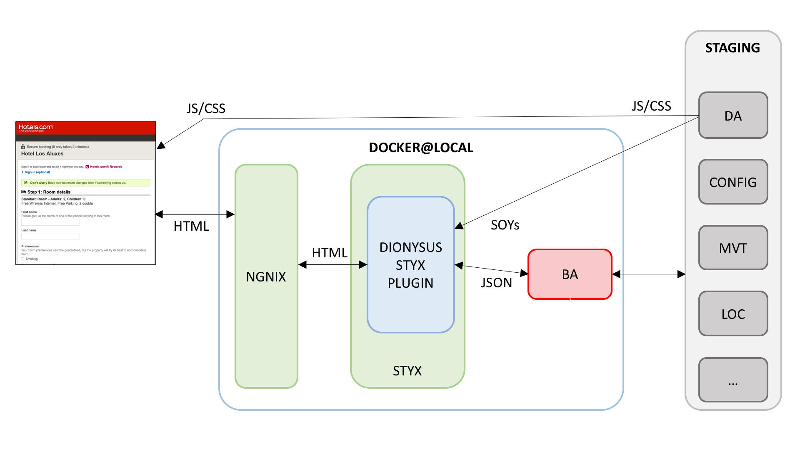

# Checkout Local Environment

The CKO local environment aims to simplify development and testing of checkout FE apps in local.

It leverages the [local-app-server](https://github.expedia.biz/hotels-platform/local-app-server) to serve the CKO FE apps HTML pages using the dionysus styx plugin.



#### Stubbed hotels and supported features:

Please refer to the checkito README for a full list of stubbed hotels and supported features: http://stash.hcom/projects/COP/repos/checkito/browse

#### Limitations

TBW

## Setup

### Windows pre-requirements

To facilitate the maintenance, there is a single (_bash_) script to set up the environment.

To run it on Windows, *Git BASH* is strongly recommended. It can be downloaded form https://gitforwindows.org/.
If you're already using another BASH emulation tool you can use that one as well.

When running bash scripts on Docker, make sure the line endings of the scripts
are Unix-style single LF, otherwise you can get "no such file" errors. It is recommended to checkout git repositories with
the ***git config core.autocrlf input*** option.
See the **Troubleshooting common issues** section for more info.

During the installation few setup choice have to made. If you're not sure what to select, keep the default choice.

### Install Docker CE (Mac/Win)

Download, install and launch Docker CE

* WIN: https://store.docker.com/editions/community/docker-ce-desktop-windows
* MAC: https://store.docker.com/editions/community/docker-ce-desktop-mac

**Note:** If you are migrating from Docker Toolbox you will be asked to import your existing docker machine.
In case you have any docker image that you want to keep, select "Copy" - Otherwise "Skip"


#### WIN specific setup

* Share the drive on which the local environment folder will be checked out: `Docker -> Settings -> Shared Drives`


* Add `C:\Program Files\Docker\Docker\Docker for Windows.exe` to PATH env variables (both system and profile):


* Make sure you're exposing the daemon on localhost without TLS


### Migrating from Docker Toolbox

If you already have an installation of Docker Toolbox and you want to upgrade you need to remove the Docker ENV variables:
1. Close all your terminal windows
2. Remove any docker related environment variable that you have possibly set in any of your profile file (.bashrc, .profile, .bash_profile)

For more details on how to migrate from Docker Toolbox read these:
* https://docs.docker.com/docker-for-mac/docker-toolbox/
* https://wiki.hcom/display/HTS/Upgrading+to+Docker+for+Mac

### Login to the registry using your SEA credentials

    docker login kumo-docker-release-local.artylab.expedia.biz
    
### Increase the docker resources

In `Docker -> Preferences -> Advanced`
* increase the docker memory to at least 4GB
* Increase the number of CPU to 6


### hosts file

Please update your hosts file with the following.

*Note:* If you already have the `*.dev-hotels.com` domains in your hosts file, you need to substitute them.

`hosts` file location:
* MAC/UNIX: `/etc/hosts`
* WIN: `C:\Windows\System32\drivers\etc`

```
127.0.0.1 dev-hotels.com
127.0.0.1 en.dev-hotels.com
127.0.0.1 www.dev-hotels.com ssl.dev-hotels.com
127.0.0.1 www.dev-hotels.ca ssl.dev-hotels.ca
127.0.0.1 www.dev-hoteles.com ssl.dev-hoteles.com
127.0.0.1 www.dev-hoteis.com ssl.dev-hoteis.com
127.0.0.1 www.dev-hotels.com ssl.dev-hotels.com
127.0.0.1 us.dev-hotels.com ssl-us.dev-hotels.com
127.0.0.1 uk.dev-hotels.com ssl-uk.dev-hotels.com
127.0.0.1 fr.dev-hotels.ca ssl-fr.dev-hotels.ca
127.0.0.1 ar.dev-hotels.com ssl-ar.dev-hotels.com
127.0.0.1 cs.dev-hotels.com ssl-cs.dev-hotels.com
127.0.0.1 da.dev-hotels.com ssl-da.dev-hotels.com
127.0.0.1 de.dev-hotels.com ssl-de.dev-hotels.com
127.0.0.1 el.dev-hotels.com ssl-el.dev-hotels.com
127.0.0.1 et.dev-hotels.com ssl-et.dev-hotels.com
127.0.0.1 fi.dev-hotels.com ssl-fi.dev-hotels.com
127.0.0.1 fr.dev-hotels.com ssl-fr.dev-hotels.com
127.0.0.1 he.dev-hotels.com ssl-he.dev-hotels.com
127.0.0.1 hr.dev-hotels.com ssl-hr.dev-hotels.com
127.0.0.1 hu.dev-hotels.com ssl-hu.dev-hotels.com
127.0.0.1 is.dev-hotels.com ssl-is.dev-hotels.com
127.0.0.1 it.dev-hotels.com ssl-it.dev-hotels.com
127.0.0.1 jp.dev-hotels.com ssl-jp.dev-hotels.com
127.0.0.1 kr.dev-hotels.com ssl-kr.dev-hotels.com
127.0.0.1 lt.dev-hotels.com ssl-lt.dev-hotels.com
127.0.0.1 lv.dev-hotels.com ssl-lv.dev-hotels.com
127.0.0.1 ms.dev-hotels.com ssl-ms.dev-hotels.com
127.0.0.1 nl.dev-hotels.com ssl-nl.dev-hotels.com
127.0.0.1 no.dev-hotels.com ssl-no.dev-hotels.com
127.0.0.1 pl.dev-hotels.com ssl-pl.dev-hotels.com
127.0.0.1 ru.dev-hotels.com ssl-ru.dev-hotels.com
127.0.0.1 sk.dev-hotels.com ssl-sk.dev-hotels.com
127.0.0.1 sv.dev-hotels.com ssl-sv.dev-hotels.com
127.0.0.1 th.dev-hotels.com ssl-th.dev-hotels.com
127.0.0.1 tr.dev-hotels.com ssl-tr.dev-hotels.com
127.0.0.1 uk.dev-hotels.com ssl-uk.dev-hotels.com
127.0.0.1 zh.dev-hotels.com ssl-zh.dev-hotels.com
127.0.0.1 pt.dev-hoteles.com ssl-pt.dev-hoteles.com
127.0.0.1 cn.dev-hotels.com ssl-cn.dev-hotels.com ssl.dev-hotels.cn
127.0.0.1 es.dev-hotels.com ssl-es.dev-hotels.com
127.0.0.1 ca.dev-hotels.com ssl-ca.dev-hotels.com
127.0.0.1 nz.dev-hotels.com ssl-nz.dev-hotels.com
127.0.0.1 in.dev-hotels.com ssl-in.dev-hotels.com
127.0.0.1 iw.dev-hotels.com ssl-iw.dev-hotels.com
127.0.0.1 www.dev-hoteis.com br.dev-hoteis.com ssl.dev-hoteis.com pt.dev-hotels.com
127.0.0.1 www.dev-hoteles.com mx.dev-hoteles.com ssl.dev-hoteles.com
127.0.0.1 tw.dev-hotels.com ssl-tw.dev-hotels.com

#AFFILIATES
127.0.0.1 hotels.dev-united.com ssl.dev-united.com
127.0.0.1 hotels.dev-latam.com ssl.dev-latam.com
127.0.0.1 hotels.dev-multiplus.com ssl.dev-mulitplus.com
127.0.0.1 hotels.dev-hotelurbano.com ssl.dev-hotelurbano.com
127.0.0.1 hotels.dev-hcombest.com ssl.dev-hcombest.com

#CHECKITO
127.0.0.1 checkito.hcom checkito
```

### Checkout the local environment

The local environment scripts and assets are in the git `checkouttools` repo.
Clone the repo.

    $ cd <workspace_folder>
    $ git clone http://<sea_username>@stash.hcom/scm/cop/checkouttools.git

## Usage

### Start/Stop

Move under the `local_environment`, give execution permissions to the `local_env.sh` bash script and run it.

NOTE: the `local_env.sh` needs BASH version 4.x (or later) in order to work correctly. 
Since macOS comes with an older version by default that is not suitable for running the script, 
please check the bash version and upgrade it manually if needed. 

    $ cd <local_environment_root_folder>
    $ chmod a+x local_env.sh
    $ ./local_env.sh
    Usage: local_env.sh <command> <options>
    Commands:
    start [-proxy]                                         Start the local environment, with no front-end apps (BA)
    start -ba-version <ba-version> [-no-stub] [-proxy]     Start the local environment, using the BA version: <ba-version>
    start -bma-version <bma-version> [-no-stub] [-proxy]   Start the local environment, using the BMA version: <bma-version>
    start -bca-version <bca-version> [-no-stub] [-proxy]   Start the local environment, using the BMA version: <bma-version>
    stop                                                   Stop the local environment
    status                                                 Print the local environment status
    start-app <app_id>                                     Start only the specified app ( mvt ba bma bca checkito styxpres nginx )
    stop-app <app_id>                                      Stop only the specified app ( mvt ba bma bca checkito styxpres nginx )
    update [<app_id>]                                      Update local environment scripts, along with the specified app ( checkito styxpres nginx ).
                                                           By default updates styxpres, chekito and mvt docker images
    
    Options:
    -no-stub                                               Start the local environment without using checkito as mocking server (by default is using Checkito)
    -proxy                                                 Set the local environment proxy host to docker.for.mac.localhost:8888

----

*[WINDOWS]*:

If you're using Git BASH and the above command is not working you may need to use _sh_ instead of _./_ :

    sh local_env.sh <command> <options>
----

#### Start

The environment can be started with some options.

##### Start the environment without Front End Apps 

    ./local_env.sh start

##### Start the environment with Front End Apps 

    ./local_env.sh start -ba-version <ba-version> -bma-version <bma-version> -bca-version <bca-version>

If you need only 1 of the apps just skip the other.
In order to check that everything works you can open the following [stubbed hotel link](https://uk.dev-hotels.com/booking/details.html?locale=en_GB&tab=description&destinationId=1506246&hotelId=977212000&arrivalDate=25-01-2021&departureDate=26-01-2021&rooms[0].numberOfAdults=1&validate=false&previousDateful=false&reviewOrder=date_newest_first&rateCode=20210125%7C20210126%7CW%7C254%7C107255%7CSUI.QN%7CGARA%7CRO%7C%7C1%7E1%7E0%7C%7CN&roomTypeCode=SUI.QN&tspid=82&businessModel=MERCHANT&ratePlanConfiguration=REGULAR&currency=GBP&marketingChannelCode=20&ratePlanType=UNKNOWN&init=true&bookingRequest.nightlyPrice=false&bookingRequest.taxExclusive=false)

*Note:* the first time you start the local environment the setup may take a few minutes, since it needs to downloads various docker images.
*Note:* if you're running all 3 frontend apps you need to increase the memory to at least 6GB. See paragraph: Increase the docker resources.

#### Stop

    ./local_env.sh stop

#### Status

    ./local_env.sh status

#### Start a single app

    ./local_env.sh start-app <app> <options>

*Examples*

* `./local_env.sh start-app ba -ba-version 123.0.7220`
* `./local_env.sh start-app checkito`

#### Stop a single app

    ./local_env.sh stop-app <app>

*Examples*

* `./local_env.sh stop-app ba`
* `./local_env.sh start-app checkito`

#### Update

Update local environment scripts, along with the specified `<app_id>`. By default updates styxpres, chekito and mvt docker images.
    
    ./local_env.sh update [<app_id>]

*Examples*

* `./local_env.sh update`
* `./local_env.sh update checkito`

### Checkito

Checkito is running with default settings:

* http: 8089
* https: 8189

### BA testing

You can test the following BA use case:
* BA stable version
* BA feature-branch
* BA built in local

the only difference between the 3 use cases above is the version of the BA to be provided.

**BA version example**

* BA stable version:

`./local_env.sh start -ba-version 120.0.7090`

* BA feature-branch:

`./local_env.sh start -ba-version 120.0.feature_CHOP_2658_availabilty_price_check_feature_branch.4`

* BA built in local:

`./local_env.sh start -ba-version latest`

*Note:* in order to build the BA in local you need to use the profile `-Pbuild-local`.

    $ cd <bookingapp_root_folder>
    $ mvn clean install -Pbuild-local

### DUP Feature branch testing

DUP feature branch testing in local can be performed in the same way as in staging.
You just need either to specify the DUP `feature-branch` parameter on the BF get url or set the DUP feature-branch cookie

### Logging

All the local environment application logs are appended under the folder `logs`.

    $ cd <local_environment_root_folder>/logs
    $ tail -f <app>.log

### BA DEBUG

The fixed BA debugging port is `1901`
You can change this in the local_environment `<local_environment_root_folder>/docker-compose.yml`, but if need to do it please make it configurable via the startup script.

The remote JMX port is exposed on `38007`

### BMA DEBUG

The fixed BMA debugging port is `2001`
You can change this in the local_environment `<local_environment_root_folder>/docker-compose.yml`, but if need to do it please make it configurable via the startup script.

The remote JMX port is exposed on `39007`

### BCA DEBUG (plan)

The fixed BCA debugging port is `2101`
You can change this in the local_environment `<local_environment_root_folder>/docker-compose.yml`, but if need to do it please make it configurable via the startup script.

### Checkito DEBUG

The fixed BA debugging port is `2201`

### Proxying

Enabling the local proxy via the startup script is only supported in MAC with a fixed proxy host value: `docker.for.mac.localhost:8888`.
Just specify the option `-proxy` while starting the environment.

    $./local_env.sh start-app ba -ba-version latest -proxy

If you need to enable the local proxy in WIN or if you want to modify the proxy host address, you can add the following configuration into the local_environment `<local_environment_root_folder>/docker-compose.yml` file.

    # Proxy resources
    - APP_http.proxyHost=docker.for.mac.localhost
    - APP_http.proxyPort=8888
    - APP_https.proxyHost=docker.for.mac.localhost
    - APP_https.proxyPort=8888
    - APP_proxyHost=docker.for.mac.localhost
    - APP_proxyPort=8888

### Trusting private SSL certs

Please refer to: https://pages.github.expedia.biz/hotels-checkout/bookingapp/trusting-ssl-certs-locally.html

## Troubleshooting common issues

* No CSS/JS - This indicates you have not accepted the `a*-cdn-hotels.com` domain certificates. Please trust like you do on staging or milan.

* Not seeing the header? You're not setting the MVT `4418.1`

* Update the docker spotify plugin version to `0.4.13` if you have got the following error building your local image

    ```org.apache.http.conn.HttpHostConnectException: Connect to localhost:2375 [localhost/127.0.0.1] failed: Connection refused```

* If you're having login error while downloading nginx

    ```Get https://registry-1.docker.io/v2/library/nginx/manifests/mainline-alpine: unauthorized: incorrect username or password```

  you may have messed up your docker login and you just need to logout

    ```docker logout```

* Locally built BA does not start with "no such file or directory" error on Windows?
    
    ```
    ba | standard_init_linux.go:185: exec user process caused "no such file or directory"
    ba exited with code 1
    ```
  This error usually means you are trying to run a sh/bash script with Windows-style endings
  in Docker, most likely **init_with_vault.sh** in BA. Set this file's line endings from CRLF to LF.

  It is also recommended to configure your git to checkout files as-is, without line-ending conversion:
    ```sh
    $ git config core.autocrlf input
    ```

* If you got ```2 matches found based on name: network local_environment_default is ambiguous``` during startup
  
  This error means that you have two **local_environment_default**.
  
  You can check it with the ```docker network ls``` command.
  
  You can solve this error by removing one of the localenvironment_default network from the list.  
  To do this yous should use the ```docker network rm <networkid>``` command. 

* If styxpres does not start and the styxpres.log contains the following error:
    ```
    styxpres/origins.yaml does not exist, waiting for one for 60sec
    styxpres/origins.yaml does not exist, waiting for one for 59sec
    styxpres/origins.yaml does not exist, waiting for one for 58sec
    styxpres/origins.yaml does not exist, waiting for one for 57sec
    ...
    ```
    
    Delete all containers and images and run the environment again. If the issue persists, see the section on resetting Windows credentials.
    
    ```
    docker rm $(docker ps -a -q)
    docker rmi $(docker images -q)
    ```
    
* **Windows Credentials**: if you have recently changed your login password you will need to reconfigure the shared drive.
    
    Docker -> Settings -> Shared drives -> click "Reset credentials...", tick the checkbox next to the "C" drive again, click Apply, then docker prompts you for the new password.

* BMA startup fails when downloading `http://dispatcherapp.staging.hcom/templates/dionysus_ui_pack_templates-63.0.zip`?  Try increasing Docker's memory to at least 5GB.

* If launching the local_env.sh starts with a warning message like `declare -A: invalid option`, although docker logs in successfully and the mvt app seems to be starting as well, 
  in the end, the script terminates with an `exited with code 137` error.
  
  The above-mentioned warning message indicates that the bash cannot interpret the script, probably because the bash version is below the minimum requirements.
  This is a unix-specific issue since macOS comes with an older version by default that is not compatible with the script.
  Please check your bash version with `bash --version` and upgrade it manually (to 4.x or later) if necessary.


## FAQ

**Question:** How can I ran my not docker application using my IDE with local-environment?

**Answer:**
You have to start your application using a starter script from the IDE setting the following properties:

In the Parameters tab:

    Command line: initialize tomcat7:run
    Profiles: fast start-devrom

In the Runner tab:
The following setting is optional just if you want to use the proxy

`VM Options: -Dhttp.proxyHost=localhost -Dhttp.proxyPort=8888 -Dhttps.proxyHost=localhost -Dhttps.proxyPort=8888`

Add as properties:

`WEBSITE_DOMAIN_DISCRIMINATOR: staging-1` or `dev-` if you want use the cookie set in a particular domain

`MVT_BUSINESS_CONFIGURATION_HOME` pointing to your mvtconfigurationpack local folder

Get the mvtconfigurationpack by cloning ssh://git@stash.hcom:7999/hweb/mvtconfigurationpack.git

As example: MVT_BUSINESS_CONFIGURATION_HOME=/Users/jhon/git/HWEB/mvtconfigurationpack

Note: In this case all the env variables in the docker-compose are not used.
The app start with the start-devrom profile and uses the development properties.
The start-devrom profile in the BookingApp project setup some tomcat properties.
The properties are read from the build/dev/tomcat/devrom_server_configuration.properties

In the local_environment you have to change the origins.yaml for the ba.
To point to your local machine and not the docker machine:

    - id: "book"
      path: "/ba/"
      rewrites:
      ...
      origins:
      # commented - { id: "ba.docker",    host: "ba:8443" }
        - { id: "local-ba-mac", host: "docker.for.mac.localhost:30443" }

**Question:** How to compile the BookingApp locally?

**Answer:**

Update your settings.xml maven file with the following one:

```
<settings xmlns="http://maven.apache.org/SETTINGS/1.0.0" xmlns:xsi="http://www.w3.org/2001/XMLSchema-instance" xsi:schemaLocation="http://maven.apache.org/SETTINGS/1.0.0 http://maven.apache.org/xsd/settings-1.0.0.xsd">
   <localRepository>${user.home}/.m2/repository</localRepository>
   <servers>
        <server>
            <username>readonly</username>
            <password>\{DESede\}CFUTXBvK0gmItVG/gst/7g==</password>
            <id>central</id>
        </server>
        <server>
            <username>readonly</username>
            <password>\{DESede\}CFUTXBvK0gmItVG/gst/7g==</password>
            <id>snapshots</id>
        </server>
   </servers>
   <profiles>
        <profile>
            <id>artifactory</id>
            <repositories>
                <repository>
                    <id>central</id>
                    <name>libs-release</name>
                    <url>http://bin.hotels.com/artifactory/libs-release</url>
                </repository>
                <!--repository>
                    <id>snapshots</id>
                    <name>libs-snapshot</name>
                    <url>http://bin.hotels.com/artifactory/libs-snapshot</url>
                    <releases>
                        <enabled>false</enabled>
                    </releases>
                </repository-->
            </repositories>
            <pluginRepositories>
                <pluginRepository>
                    <id>central</id>
                    <name>plugins-release</name>
                    <url>http://bin.hotels.com/artifactory/plugins-release</url>
                </pluginRepository>
                <pluginRepository>
                    <id>snapshots</id>
                    <name>plugins-snapshot</name>
                    <url>http://bin.hotels.com/artifactory/plugins-snapshot</url>
                    <releases>
                        <enabled>true</enabled>
                    </releases>
                </pluginRepository>
            </pluginRepositories>
        </profile>
    </profiles>
    <activeProfiles>
        <activeProfile>artifactory</activeProfile>
    </activeProfiles>
</settings>
```

Run:
mvn clean install
mvn clean install -Pfast (to skip checkstyle and all the tests)

## Contributing

Contribution is always the key. If you find any issue or you want to make an improvement, please open a PR and ask your CKO friends to review it.

If you feel something is missing or you want to suggest any improvement, please report it to this [confluence page](https://confluence/pages/viewpage.action?pageId=878693711)

## Developers Notes

The local env is based on the STYX project local-app-server: http://stash.hcom/projects/STYX/repos/local-app-server/browse

Components involved:
* ngnix: reverse proxy
* styx: html page rendering
* CKO FE apps: BA, BMA, BCA
* checkito: CKO mock servers

Styx DUP plugin only serves the html (rendering the soy files), the assets (JS, CSS) are served by the staging DispatcherApp (DA):
* the DA reads the JS and CSS from File System DUP folders
* there is a DUP folder for each branch

Use `docker stats` command to display stats for all of your running containers.
This command will show you the resources that each container is using(e.g. CPU & memory usage).
