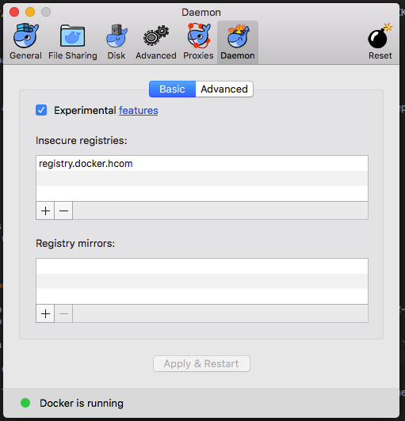

# Checkout Local Environment

The CKO local environment aims to simplify development and testing of checkout FE apps in local.

It leverage the [local-app-server](http://stash.hcom/projects/STYX/repos/local-app-server/browse) to serve the CKO FE apps HTML pages using the dionysus styx plugin.


**Note:** In order to enable styx html page rendering you need to set MVT variant 4418.1

#### Supported features:

Please refer to the checkito README for a full list of the supported features: http://stash.hcom/projects/COP/repos/checkito/browse

#### Limitations

TBW

## Setup

### Install Docker CE (Mac/Win)

Download and install Docker CE from https://www.docker.com/community-edition#/download

**Upgrading from Docker Toolbox**

If you already have an installation of Docker Toolbox and you want to upgrade you can read these:
* https://docs.docker.com/docker-for-mac/docker-toolbox/
* https://wiki.hcom/display/HTS/Upgrading+to+Docker+for+Mac

### Mark internal registries as "Insecure"

Add the internal registries in `Docker -> Preferences -> Daemon panel:`



### Login to the registry

Login to registry using your SEA credentials

    docker login registry.docker.hcom

*Note*: If you get the following error:

    Error response from daemon: login attempt to http://registry.docker.hcom/v2/ failed with status: 500 Internal Server Error

add the disable-legacy-registry flag set to false in `Docker -> Preferences -> Daemon


### hosts file

Please update your hosts file with the following.

`hosts` file location:
* MAC/UNIX: `/etc/hosts`
* WIN: `C:\Windows\System32\drivers\etc`

```
127.0.0.1 dev-hotels.com
127.0.0.1 en.dev-hotels.com
127.0.0.1 www.dev-hotels.com ssl.dev-hotels.com
127.0.0.1 www.dev-hotels.ca ssl.dev-hotels.ca
127.0.0.1 www.dev-hoteles.com ssl.dev-hoteles.com
127.0.0.1 www.dev-hoteis.com ssl.dev-hoteis.com
127.0.0.1 www.dev-hotels.com ssl.dev-hotels.com
127.0.0.1 us.dev-hotels.com ssl-us.dev-hotels.com
127.0.0.1 uk.dev-hotels.com ssl-uk.dev-hotels.com
127.0.0.1 fr.dev-hotels.ca ssl-fr.dev-hotels.ca
127.0.0.1 ar.dev-hotels.com ssl-ar.dev-hotels.com
127.0.0.1 cs.dev-hotels.com ssl-cs.dev-hotels.com
127.0.0.1 da.dev-hotels.com ssl-da.dev-hotels.com
127.0.0.1 de.dev-hotels.com ssl-de.dev-hotels.com
127.0.0.1 el.dev-hotels.com ssl-el.dev-hotels.com
127.0.0.1 et.dev-hotels.com ssl-et.dev-hotels.com
127.0.0.1 fi.dev-hotels.com ssl-fi.dev-hotels.com
127.0.0.1 fr.dev-hotels.com ssl-fr.dev-hotels.com
127.0.0.1 he.dev-hotels.com ssl-he.dev-hotels.com
127.0.0.1 hr.dev-hotels.com ssl-hr.dev-hotels.com
127.0.0.1 hu.dev-hotels.com ssl-hu.dev-hotels.com
127.0.0.1 is.dev-hotels.com ssl-is.dev-hotels.com
127.0.0.1 it.dev-hotels.com ssl-it.dev-hotels.com
127.0.0.1 jp.dev-hotels.com ssl-jp.dev-hotels.com
127.0.0.1 kr.dev-hotels.com ssl-kr.dev-hotels.com
127.0.0.1 lt.dev-hotels.com ssl-lt.dev-hotels.com
127.0.0.1 lv.dev-hotels.com ssl-lv.dev-hotels.com
127.0.0.1 ms.dev-hotels.com ssl-ms.dev-hotels.com
127.0.0.1 nl.dev-hotels.com ssl-nl.dev-hotels.com
127.0.0.1 no.dev-hotels.com ssl-no.dev-hotels.com
127.0.0.1 pl.dev-hotels.com ssl-pl.dev-hotels.com
127.0.0.1 ru.dev-hotels.com ssl-ru.dev-hotels.com
127.0.0.1 sk.dev-hotels.com ssl-sk.dev-hotels.com
127.0.0.1 sv.dev-hotels.com ssl-sv.dev-hotels.com
127.0.0.1 th.dev-hotels.com ssl-th.dev-hotels.com
127.0.0.1 tr.dev-hotels.com ssl-tr.dev-hotels.com
127.0.0.1 uk.dev-hotels.com ssl-uk.dev-hotels.com
127.0.0.1 zh.dev-hotels.com ssl-zh.dev-hotels.com
127.0.0.1 pt.dev-hoteles.com ssl-pt.dev-hoteles.com
127.0.0.1 cn.dev-hotels.com ssl-cn.dev-hotels.com ssl.dev-hotels.cn
127.0.0.1 es.dev-hotels.com ssl-es.dev-hotels.com
127.0.0.1 ca.dev-hotels.com ssl-ca.dev-hotels.com
127.0.0.1 nz.dev-hotels.com ssl-nz.dev-hotels.com
127.0.0.1 in.dev-hotels.com ssl-in.dev-hotels.com
127.0.0.1 iw.dev-hotels.com ssl-iw.dev-hotels.com
127.0.0.1 www.dev-hoteis.com br.dev-hoteis.com ssl.dev-hoteis.com pt.dev-hotels.com
127.0.0.1 www.dev-hoteles.com mx.dev-hoteles.com ssl.dev-hoteles.com
127.0.0.1 tw.dev-hotels.com ssl-tw.dev-hotels.com

#AFFILIATES
127.0.0.1 hotels.dev-united.com ssl.dev-united.com
127.0.0.1 hotels.dev-latam.com ssl.dev-latam.com
127.0.0.1 hotels.dev-multiplus.com ssl.dev-mulitplus.com
127.0.0.1 hotels.dev-hotelurbano.com ssl.dev-hotelurbano.com
127.0.0.1 hotels.dev-hcombest.com ssl.dev-hcombest.com
```

## Usage

Give execution permissions to the `local_env.sh` bash script and run it.

    $ cd <local_env_root_folder>
    $ chmod a+x local_env.sh 
    $ ./local_env.sh <command> <options>
    Commands:
    start                               Start the local environment
      -ba <ba-version>                  BA version to run. Required.
    stop                                Stop the local environment
    status                              Print the local environment status

### Start
    ./local_env.sh start -ba <ba-version>
    
Note: 
To test a specific branch/feature, build you branch on the BookingApp running the following command from the root foled of the bookingapp project:
     mvn clean install -Pbuild-local
Once the build it will be created an image of the BookingApp with version dev.0
To start this image run the command:  
    ./local_env.sh start -ba dev.0

**Custom apps version example**
* `./local_env.sh start -ba 120.0.7090`
* `./local_env.sh start -ba 120.0.feature_CHOP_2658_availabilty_price_check_feature_branch.4`   
    
### Stop

    ./local_env.sh stop

### Status

    ./local_env.sh status


## Trouble shooting common issues

* No CSS/JS - This indicates you have not accepted the `a*-cdn-hotels.com` domain certificates. Please trust like you do on staging or milan.
* Update the docker spotify plugin version to `0.4.13` if you have got the following error building your local image 

    ```org.apache.http.conn.HttpHostConnectException: Connect to localhost:2375 [localhost/127.0.0.1] failed: Connection refused```

## FAQ

TBW

## Contributing

Contribution is always the key. If you find any issue or you want to make an improvement, please open a PR and ask your CKO friends to review it.

## Developers Notes

The local env is based on the STYX project local-app-server: http://stash.hcom/projects/STYX/repos/local-app-server/browse

Components involved:
* ngnix: reverse proxy
* styx: html page rendering
* CKO FE apps: BA, BMA, BCA
* checkito: CKO mock servers

Styx DUP plugin only serves the html (rendering the soy files), the assets (JS, CSS) are served by the staging DispatcherApp (DA):
* the DA reads the JS and CSS from File System DUP folders
* there is a DUP folder for each branch

